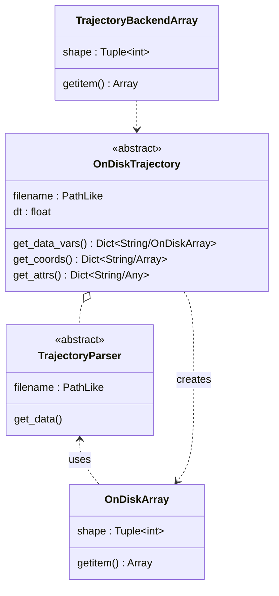

# Class Relationships

```mermaid
classDiagram
    class OnDiskArray {
        shape : Tuple~int~
        getitem() Array
    }
    
    class TrajectoryParser {
        <<abstract>>
        filename : PathLike
        get_data()
    }

    class OnDiskTrajectory {
        <<abstract>>
        filename : PathLike
        dt : float

        get_data_vars() Dict~String/OnDiskArray~
        get_coords() Dict~String/Array~
        get_attrs() Dict~String/Any~
    }

    TrajectoryParser <.. OnDiskArray : uses
    OnDiskTrajectory o.. TrajectoryParser
    OnDiskTrajectory ..> OnDiskArray : creates

    class TrajectoryBackendArray {
        shape : Tuple~int~
        getitem() Array
    }
    TrajectoryBackendArray ..> OnDiskTrajectory
```