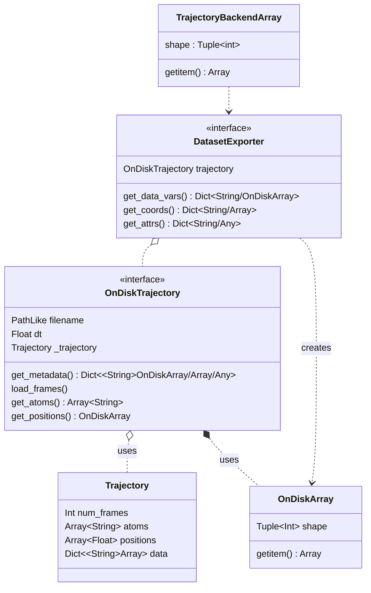

# Class Relationships

```mermaid
classDiagram
    class OnDiskArray {
        Tuple~Int~ shape
        getitem() Array
    }

    class Trajectory {
        Int num_frames
        Array~String~ atoms
        Array~Float~ positions
        Dict~~String~Array~ data
    }
    
    class OnDiskTrajectory {
        <<interface>>
        PathLike filename
        Float dt
        Trajectory _trajectory
        get_metadata() Dict~~String~OnDiskArray/Array/Any~
        load_frames()
        get_atoms() Array~String~
        get_positions() OnDiskArray
    }

    OnDiskTrajectory o.. Trajectory : uses

    class DatasetExporter {
        <<interface>>
        OnDiskTrajectory trajectory

        get_data_vars() Dict~String/OnDiskArray~
        get_coords() Dict~String/Array~
        get_attrs() Dict~String/Any~
    }

    OnDiskTrajectory *.. OnDiskArray : uses
    DatasetExporter o.. OnDiskTrajectory
    DatasetExporter ..> OnDiskArray : creates

    class TrajectoryBackendArray {
        shape : Tuple~int~
        getitem() Array
    }
    TrajectoryBackendArray ..> DatasetExporter
```